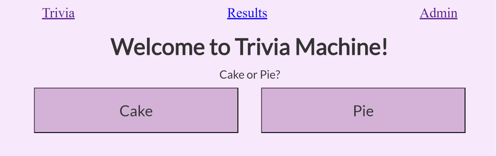
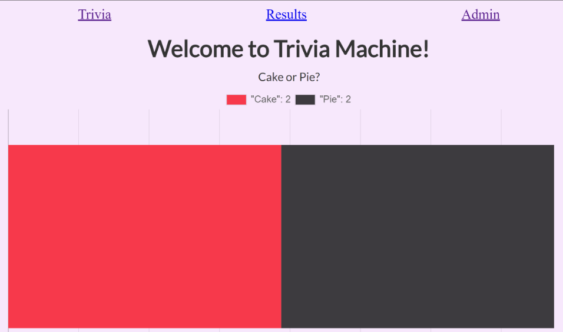
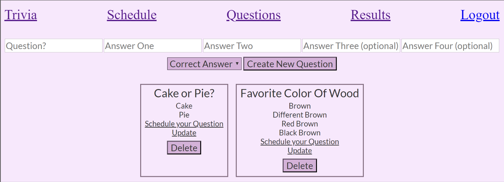
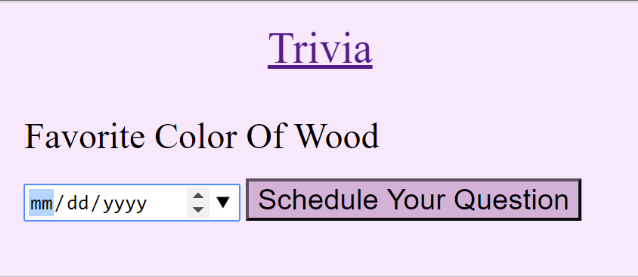
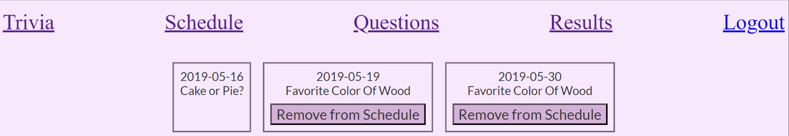
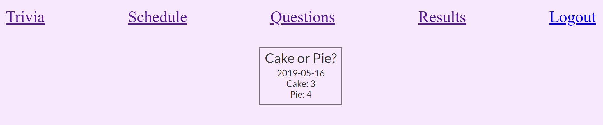

# Application Screenshots

### User Interface Voting

    This shot shows the user interface without the admin view. All users who visit the application are able to vote on
    the daily question or opinion poll.

### Results

    Upon voting, the user will be redirected to a view of the total results of the present voting outcomes. This screen
    will show for 5 seconds before redirecting back to the voting screen.

### Question Creation & Question List

    Under the Admin authority, the administrator can create questions and decide whether that question will be opinion
    based or trivia styled with a correct answer set in advance. 
    
    This view will aslo show all of the saved questions that have been created in the past.

### Question Scheduling & Removal

    This view shows the ability for the admin to schedule the question for a specified day. Once the question has been
    scheduled, it will be shown to the users who visit the page on that specific day. 
    

    From this view, the question has been added to the schedule and can now be left in place and removed from the schedule.
    If the date in which it was to be shown has expired, then it will be perminently in place within the older scheduled
    questions.

### Results

    This view allows the admin to see the results from the questions that have been previously scheduled and voted on. 
    