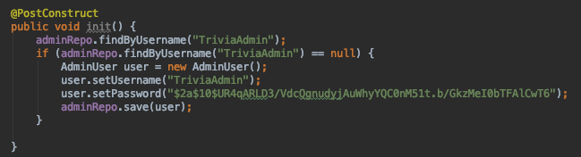
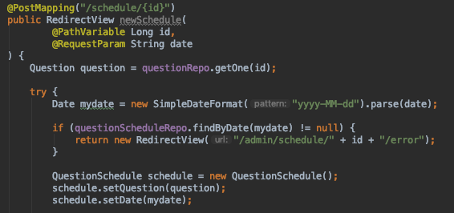
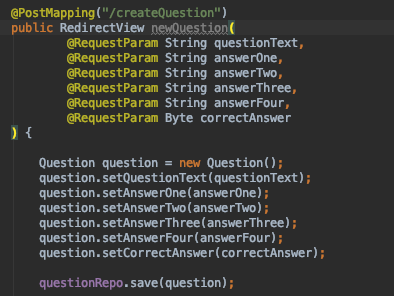
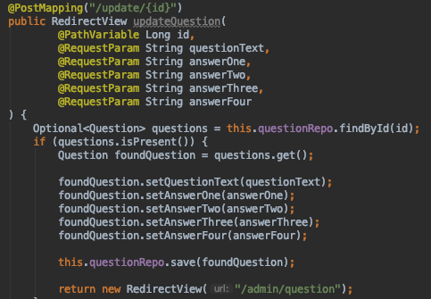
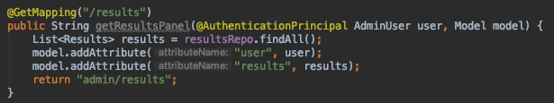
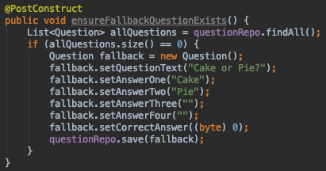
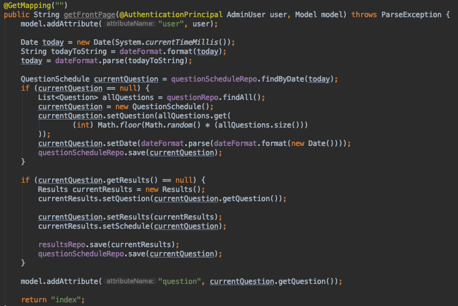
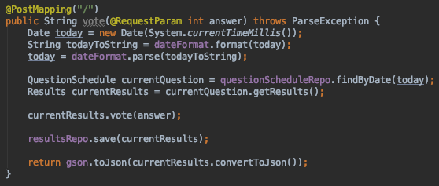

# Code Snapshots

[Test Snapshots](testScreenShots.md)

## Be the Admin

### Creation of the Default Admin

### Add a Question to the Schedule

### Create a New Question

### Update a Question

### Display the Results

## User Side

### Fallback Question

### Front Page Build

### Record the Votes

