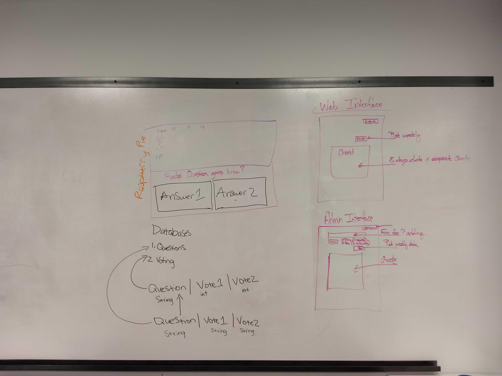

# Wire Frame

## User View

* Raspberry Pie view -
  * Hourly weather data
  * Daily question
    * 2/4 answer options based on question asked
* Web view -
  * Drop down menue with 'weekly' options
  * chart displaying the answers to selected week's questions

## Admin View

* Log In option

* Form to build new daily question
  * Question
  * Radio button, selecting 2/4 answer options
* Drop down menue with 'weekly' options

* chart displaying the answers to selected week's questions

## Database

### Questions

| questions | vote1 | vote2 | vote3 | vote4 |
|:---------:|:-----:|:-----:|:-----:|:-----:|
| String    | int   | int   | int   | int   |

### Voting

| questions | vote1 | vote2 | vote3 | vote4 |
|:---------:|:-----:|:-----:|:-----:|:-----:|
| String    | String| String| String| String|
